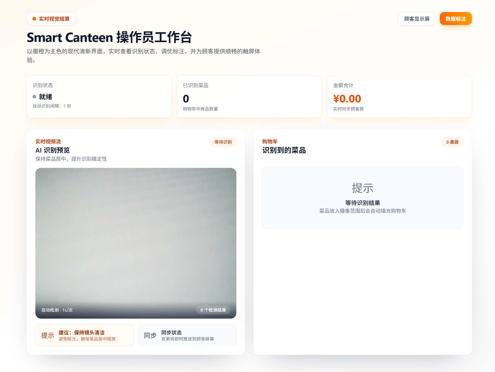
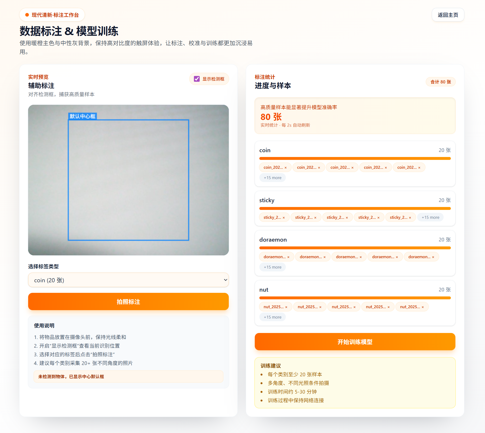

# Smart-Canteen

🍽️ AI-powered vision-based checkout system for cafeterias and canteens. Detect objects in real-time, automatically calculate prices, and streamline the payment process.


## 🌟 Features

- **Real-time Object Detection**: YOLOv8-powered ONNX inference for fast, accurate detection
- **On-Demand Recognition**: Frontend-triggered detection with 1-second intervals (replacement mode, not accumulative)
- **Dual Display Support**: Operator interface + customer-facing display synchronized in real-time
- **Live Video Stream**: MJPEG streaming with bounding box visualization
- **Offline-First**: Fully functional without internet connection
- **Custom Training Pipeline**: Built-in annotation tool with YOLOv8n pre-trained model assistance
- **Flexible Configuration**: JSON-based class definitions and price mappings
- **OTA Model Updates**: Remote model version management and updates
- **Cart Management**: Automatic cart replacement based on detection results (clears when empty)

## 📁 Project Structure

```
smart-canteen/
├── backend/              # Python FastAPI server
│   ├── main.py          # Core API endpoints and inference engine
│   ├── camera.py        # Camera management (OpenCV)
│   ├── annotation.py    # Training data annotation and model training
│   ├── data/
│   │   ├── classes.json        # YOLO class labels (e.g., coin, tapeline, square)
│   │   ├── price_map.json      # Business mapping (label → name → price)
│   │   ├── model_version.json  # OTA update metadata
│   │   └── dataset/            # Training images and labels
│   ├── models/          # ONNX/PyTorch model files
│   └── requirements.txt
├── frontend/            # Next.js 14 application
│   ├── app/
│   │   ├── page.tsx            # Operator interface (detection + cart)
│   │   ├── customer/page.tsx   # Customer display screen
│   │   └── annotate/page.tsx   # Data annotation UI
│   └── package.json
├── infra/               # Build and deployment scripts
└── docs/                # Documentation
```





## 🚀 Quick Start

### Prerequisites

- **Python**: 3.10+ (3.12 recommended)
- **Node.js**: 18+ (for Next.js frontend)
- **Camera**: USB webcam (1080p recommended)
- **OS**: Windows 10/11, Linux, or macOS

### Development Setup

#### 1. Backend (FastAPI)

```bash
cd backend
pip install -r requirements.txt
python main.py
```

Backend runs on: http://localhost:8000

**API Endpoints:**
- `GET /api/detect_once` - Trigger single detection (returns detections + updates cart)
- `GET /api/video_feed` - MJPEG stream with bounding boxes
- `GET /api/current_detection` - Get latest detection results
- `GET /api/camera_status` - Check camera availability
- `POST /api/save_annotation` - Save annotated training data
- `POST /api/start_training` - Begin model training
- `GET /api/training_status` - Monitor training progress

#### 2. Frontend (Next.js)

```bash
cd frontend
npm install
npm run dev
```

Frontend runs on: http://localhost:3000

**Pages:**
- `/` - Operator interface (detection + shopping cart)
- `/customer` - Customer-facing display (prices + total)
- `/annotate` - Data annotation tool (capture + label)

### Production Build

```bash
cd infra
python build.py
```

**Output:**
- `dist/smart-canteen/` - Standalone executables
- `dist/installer/` - Installation packages

## 🎯 Usage Workflow

### Initial Setup

1. **Configure Classes**: Edit `backend/data/classes.json`
   ```json
   ["coin", "tapeline", "square"]
   ```

2. **Set Prices**: Edit `backend/data/price_map.json`
   ```json
   {
     "coin": {"name": "Coin", "price": 1.0, "category": "Object", "enabled": true},
     "tapeline": {"name": "Tape Line", "price": 5.0, "category": "Tool", "enabled": true}
   }
   ```

3. **Update Dataset Config**: Edit `backend/data/dataset/dataset.yaml`
   ```yaml
   names:
   - coin
   - tapeline
   - square
   nc: 3
   path: D:\github\smart-canteen\backend\data\dataset
   train: train/images
   val: val/images
   ```
   **Important**: `names` list must match `classes.json` exactly, and `nc` must equal the number of classes.

4. **Annotate Training Data**:
   - Visit http://localhost:3000/annotate
   - Place object in camera view
   - Select correct label from dropdown
   - Click "📸 Capture" (20-30 samples per class recommended)
   - YOLOv8n pre-trained model provides detection assistance

4. **Train Model**:
   - Click "🚀 Start Training" on annotation page
   - Training uses optimized parameters (150 epochs, AdamW, enhanced augmentation)
   - Monitor progress in real-time (~30-45 min on CPU)
   - Model auto-converts to ONNX on completion

5. **Test Detection**:
   - Visit http://localhost:3000 (operator interface)
   - Place objects in camera view
   - System detects every 1 second on demand
   - Cart updates automatically (replacement mode)
   - Green bounding boxes appear on detected objects

### Operational Mode

1. **Operator View** (`/`):
   - Live video stream with detection boxes
   - Real-time shopping cart (auto-updates every 1s)
   - Detection status: "🔍 Detecting..." / "✓ Ready"
   - Manual "Clear Cart" button

2. **Customer View** (`/customer`):
   - Synchronized cart display
   - Item-by-item pricing
   - Total amount calculation
   - Clean, customer-friendly UI

### Cart Behavior (Important)

- **Replacement Mode** (NOT accumulative):
  - Each detection **replaces** the entire cart
  - If no objects detected → cart clears automatically
  - If 2 coins detected → cart shows "Coin x2"
  - Removes previous items completely on each detection

- **Detection Interval**: 1 second (configurable in `page.tsx`)

## 🛠️ Configuration Files

All configuration files are located in `backend/data/`:

### `classes.json`
Defines YOLO model class labels (must match training data):
```json
["coin", "tapeline", "square"]
```

### `price_map.json`
Maps labels to business information:
```json
{
  "coin": {
    "name": "Coin",
    "price": 1.0,
    "category": "Currency",
    "enabled": true
  }
}
```

### `dataset/dataset.yaml`
YOLO training dataset configuration (located in `backend/data/dataset/`):
```yaml
names:
- coin
- tapeline
- square
nc: 3
path: D:\github\smart-canteen\backend\data\dataset
train: train/images
val: val/images
```

**Critical**: The `names` list must **exactly match** `classes.json`, and `nc` (number of classes) must equal the length of `names`. Mismatch will cause training failures.

### `model_version.json`
OTA update metadata:
```json
{
  "version": "1.0.0",
  "url": "https://example.com/models/model_1.0.0.zip",
  "sha256": "checksum_here",
  "timestamp": "2024-01-01T00:00:00Z",
  "description": "Initial model release"
}
```

## 🧹 Data Management

### Clear Training Data

Use the provided PowerShell script to clean all training data, models, and annotations:

```powershell
cd backend
.\clear_training_data.ps1
```

This script removes:
- Annotation images and labels
- Train/validation splits
- Trained model files (ONNX + PyTorch)
- Training output logs

Provides statistics on deleted files and freed space.

## 🔧 Technical Details

### Backend Architecture

- **Framework**: FastAPI 0.104.1
- **Inference Engine**: Custom ONNX Runtime wrapper
- **Model**: YOLOv8n (optimized for CPU)
- **Video Processing**: OpenCV 4.10.0
- **Coordinate System**: Normalized (0-1) in postprocess, pixel conversion in predict
- **Detection Mode**: On-demand (triggered by frontend)
- **Global State**: `latest_detection` shared between detection API and video stream

### Frontend Architecture

- **Framework**: Next.js 14 (App Router)
- **UI Library**: React 18 + TailwindCSS
- **HTTP Client**: Axios
- **Polling Strategy**: Manual useEffect loop (1-second throttle)
- **State Management**: React hooks (useState, useEffect)
- **Cart Logic**: Complete replacement on each detection

### Training Pipeline

- **Epochs**: 150
- **Batch Size**: 8
- **Optimizer**: AdamW
- **Image Size**: 640x640
- **Augmentation**: Mosaic, mixup, flip, rotate, scale, translate, HSV jitter
- **Validation Split**: 20%
- **Export**: Auto-converts to ONNX for inference

### Bbox Coordinate Fix (Critical)

Previous bug caused double-scaling of coordinates:
- **Problem**: postprocess multiplied by 640, predict multiplied by scale again
- **Solution**: postprocess keeps normalized (0-1), predict converts to pixels once
- **Result**: Correct bounding box visualization

## 💻 Hardware Requirements

**Minimum:**
- CPU: Intel J1900 / Celeron N3350 (4 cores)
- RAM: 4GB
- Camera: USB 2.0 webcam (720p)
- Display: Single 1080p monitor

**Recommended:**
- CPU: Intel i3 10th gen or AMD Ryzen 3 (4C/8T)
- RAM: 8GB
- Camera: USB 3.0 webcam (1080p, 30fps)
- Display: Dual 1080p monitors (operator + customer)

## 📊 Performance

- **Inference Speed**: ~50-100ms per frame (CPU-only on i3)
- **Detection Interval**: 1 second (configurable)
- **Model Size**: ~6MB (YOLOv8n ONNX)
- **Training Time**: ~30-45 minutes for 150 epochs (CPU)
- **Confidence Threshold**: 0.25 (production setting)

## 🐛 Troubleshooting

### Green boxes not appearing
- **Cause**: Bbox coordinate scaling issue (fixed in latest version)
- **Solution**: Ensure backend is restarted after bbox fix update
- **Verification**: `curl http://localhost:8000/api/detect_once` should show reasonable bbox values (~30-640)

### Cart not updating
- **Check**: Detection status shows "🔍 Detecting..." every 1 second
- **Check**: Browser console for API errors
- **Solution**: Verify backend `/api/detect_once` endpoint is responding

### Camera not found
- **Check**: USB camera connected and not in use by other apps
- **Check**: Backend logs for camera initialization errors
- **Solution**: Close other apps using camera (Zoom, Teams, etc.)

### Training fails
- **Check**: Sufficient annotated data (20+ per class)
- **Check**: `classes.json` matches annotation labels
- **Solution**: Review annotation quality and data diversity

## 🔐 Security Considerations

- System designed for **offline operation** (no external network required)
- No customer data collection or storage
- Local-only inference and processing
- Price data stored in plain JSON (consider encryption for production)

## 🚧 Roadmap

- [ ] GPU acceleration support (CUDA/OpenVINO)
- [ ] Multi-camera support
- [ ] Database integration for transaction logging
- [ ] Mobile app for management
- [ ] Cloud-based model training service
- [ ] A/B testing for model versions

## 📄 License

MIT License - see LICENSE file for details

## 🤝 Contributing

Contributions welcome! Please:
1. Fork the repository
2. Create a feature branch
3. Commit your changes
4. Push to the branch
5. Open a Pull Request

## 📞 Support

For issues, questions, or feature requests, please open an issue on GitHub.

---

**Note**: This project is designed for educational and small-scale deployment. For large-scale production use, consider additional security hardening, error handling, and performance optimization.
